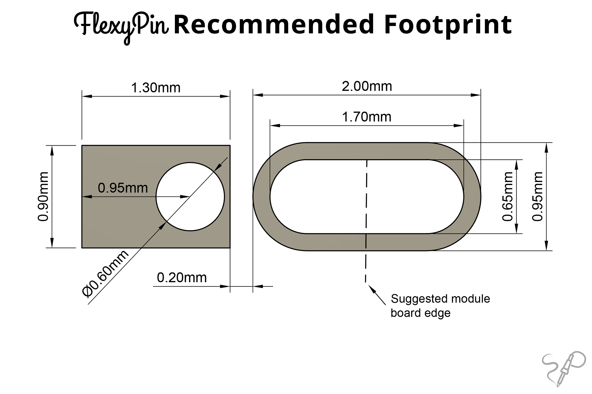

# FlexyPin

FlexyPin is a connector pin designed to be used with castellated modules with pitch down to 1.27mm.

It allows for easy insertion and removal of modules without the need for soldering. 

FlexyPin works great for flashing/testing jigs and other use-cases where castellated modules are involved.

You can get a Pack of 100 FlexyPins from our Lectronz store: https://lectronz.com/products/flexypin-pack-of-100

## KiCad footprints

You can generate footprints with custom number of pins and pitch using the `generate_footprints.py` script, run it with `--help` to learn how.

Use the `generate_lib.sh` script to generate the `FlexyPin.pretty` library with footprints for 1-40 pins with pitches 1.27mm, 1.50mm, 2.00mm, and 2.54mm.

## Footprint Dimensions

## 3D model

A 3D model is available in the `3d` directory.

## Example usage

You can find adapter designs for some common modules here: https://github.com/solderparty/flexypin_adapters_hw

You can also purchase the adapters from our Lectronz store: https://lectronz.com/stores/solderparty/